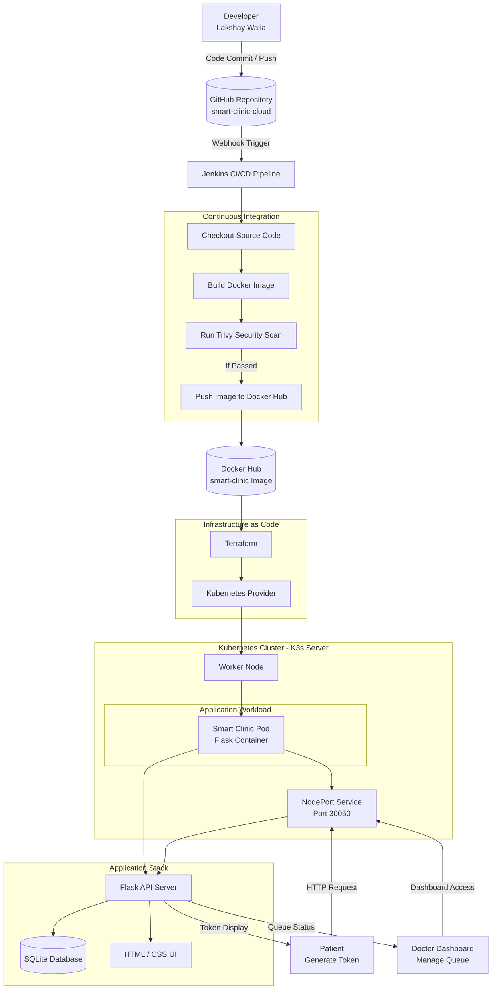
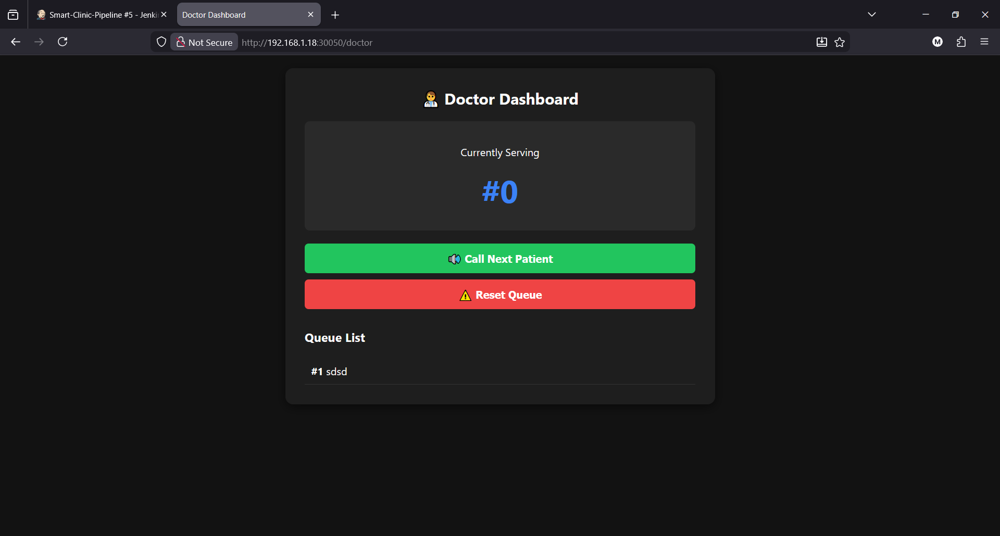
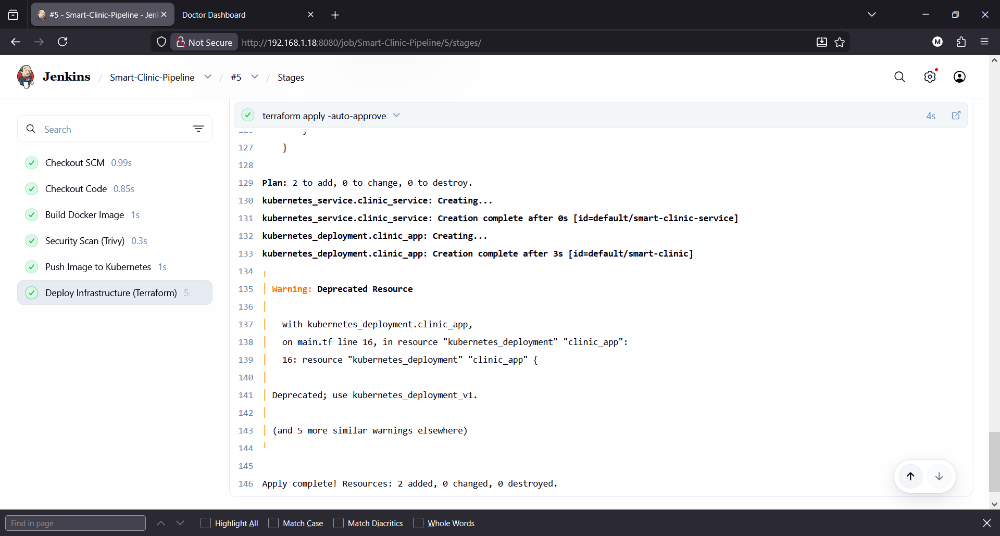

# 🏥 Smart Clinic Queue - Cloud-Native Infrastructure & SRE Pipeline
**Developed by:** Lakshay Walia | **Role:** Cloud & DevOps Engineer


---


# 📖 Executive Summary

This project represents the complete evolution of a standalone Python application into a fully automated, cloud-native microservice. Designed as a **contactless Queue Management System (QMS)** for medical clinics, it provides real-time token tracking with a synchronized doctor dashboard.

The primary focus of this repository is the **DevOps lifecycle**. It demonstrates hands-on expertise in **containerization, infrastructure as code (IaC), CI/CD automation, security scanning, and Kubernetes deployments**.

---

# 🛠️ Architecture & Tech Stack

### Application Layer
- Python (Flask)
- SQLite
- HTML5 / CSS3

### DevOps Stack
- **Docker** – Containerization
- **Jenkins** – CI/CD Automation
- **Terraform** – Infrastructure as Code
- **Kubernetes (K3s)** – Container Orchestration
- **Trivy** – Security & Vulnerability Scanning

### Registry
- Docker Hub (Container Image Storage)

---

# 📂 Repository Structure

```plaintext
smart-clinic-cloud/
├── demo/                       # UI and Architecture Screenshots
│   ├── app-ui.png
│   └── jenkins-pipeline.png
├── clinic_offline.py           # Core Flask Application
├── Dockerfile                  # Container instructions
├── Jenkinsfile                 # Jenkins CI/CD Pipeline as Code
├── main.tf                     # Terraform Kubernetes Manifests
├── requirements.txt            # Python Dependencies
└── README.md                   # Project Documentation
```

---

# 🔄 CI/CD Pipeline

The deployment lifecycle is fully automated to ensure **consistent, secure, and zero-downtime deployments**.

### Continuous Integration
Code pushes trigger Jenkins to build the Docker image automatically.

### Security Gate
Trivy scans the Docker image for vulnerabilities.

### Container Registry
The verified image is pushed to Docker Hub.

### Continuous Deployment
Terraform applies infrastructure updates to the Kubernetes cluster, ensuring **rolling updates with zero downtime**.

---

# 🚀 Complete Step-by-Step Deployment Guide

## Phase 1: Prerequisites

Ensure the following tools are installed:

- Docker
- Terraform
- Jenkins
- K3s (Lightweight Kubernetes)
- Docker Hub account

---

# Phase 2: Clone and Build

Clone the repository:

```bash
git clone https://github.com/lakshaywalia3/smart-clinic-cloud.git
cd smart-clinic-cloud
```

Authenticate Docker:

```bash
docker login
```

Build Docker Image:

```bash
docker build -t YOUR_DOCKERHUB_USERNAME/smart-clinic:latest .
```

Push Image to Docker Hub:

```bash
docker push YOUR_DOCKERHUB_USERNAME/smart-clinic:latest
```

---

# Phase 3: Infrastructure Deployment (Terraform)

Make sure your **main.tf** references your Docker Hub image.

Initialize Terraform:

```bash
terraform init
```

Deploy Infrastructure:

```bash
terraform apply -auto-approve
```

Terraform will create the Kubernetes resources and deploy the container automatically.

---

# Phase 4: Access the Application

Replace `<SERVER-IP>` with your server IP address.

**Smart Clinic Web App**

```
http://<SERVER-IP>:30050
```

This interface allows:
- Patients to generate queue tokens
- Doctors to monitor and call patients

---

# 📸 Project Showcase

## 1️⃣ Application UI



---

## 2️⃣ Automated Jenkins Pipeline



---

# 📈 DevOps Skills Demonstrated

- Containerization with Docker
- Infrastructure as Code using Terraform
- Kubernetes workload deployment
- CI/CD automation with Jenkins
- Security scanning with Trivy
- Cloud-native architecture design

---

# 👨‍💻 Author

**Lakshay Walia**  
DevOps & Cloud Engineering Portfolio

GitHub:  
https://github.com/lakshaywalia3

---

© 2026 Lakshay Walia | DevOps & Cloud Engineering Portfolio
